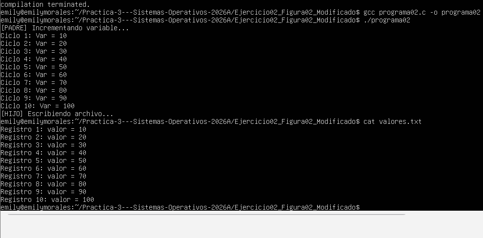

# Modificacion ejercicio 2

## Cambio de flujo y sincronización 
Se modificó la posicion original de la función wait(0). Al reubicarla al final, permitimos que el proceso padre ejecute sus incrementos
 en paralelo mientras el proceso hijo gestiona de forma asincrona la creaciòn y escritura de su propio entorno de datos. 

## Control de errores
Se gestionan fallos crìticos en la duplicación de procesos mediante el condicional case -1 dentro del switch(pid).

## Tareas en los procesos
* **Proceso Padre:**  Realiza un incremento aritmético de una variable local en paso de 10. 
* **Proceso Hijo:**  Genera un archivo independiente de texto denominado valores.txt para registrar secuencialmente cada uno de los valores.

# Evidencia de Ejecución 
{fig-align="center" width="1500x"}
