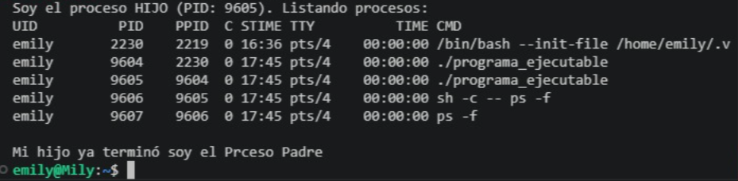

# Parte 3.3.1 de procesos hijos que enlisten los procesos del sistema usando system.

## ¿Qué se realizo?
En lenguaje C dentro de la maquina virtual,  se realizo el programa que tiene como función una  llamada al sistema fork(), con la cual se generó un proceso hijo . Con esto el programa permite que el proceso hijo lleve a cabo una tarea concreta  del sistema antes de que se acabe la ejecución del programa.

## Funciones utilizadas en el programa
Fork/ bifurcación: Dentro del programa existen dos hilos en los que sucede la ejecución.  `fork()`identifica en proceso estamos ubicados, si en el proceso padre o en el proceso hijo.
Uso de system(): Dentro del proceso hijo se empleó la siguiente función system("ps -f"), la función llama al interpretador de comandos con el objetivo de ejecutar ps, que tiene como función enlistar los procesos del sistema de manera detallada  
Sincronización: wait(NULL) se encuentra dentro del proceso padre con el objetivo que espere a que su hijo termine y muestre todo al usuario, el padre no puede acabar si su hijo aun no acaba.

## Resultados del ejecutable
Al ejecutar ./programa_ejecutable, el programa mostró exitosamente:  
1. El programa se ejecutó con exito.  
2. La tabla completa de procesos del sistema Linux (WSL).  
3. Al finalizar el proceso el padre muestra un mensaje de finalizado.

{fig-align="center" width="1500x"}
